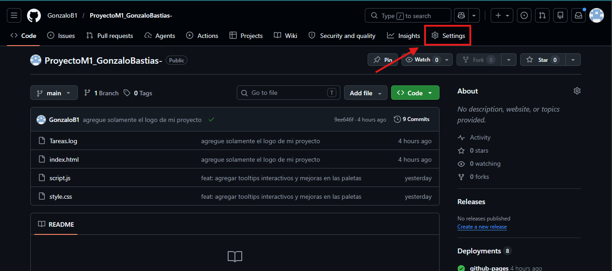
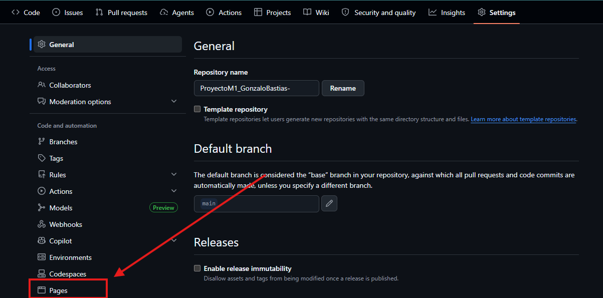

 🎨 Colorfly Studio

Aplicación web interactiva para generar paletas de colores aleatorias 

---

# 🌐 Demo del proyecto

### 🔗 GitHub Pages

https://gonzalob1.github.io/ProyectoM1_GonzaloBastias-/

### 🔗 Repositorio GitHub

https://github.com/GonzaloB1/ProyectoM1_GonzaloBastias-.git

---

# 📌 Características principales

✅ Generación aleatoria de paletas de colores
✅ Formatos HEX y HSL
✅ Selección de cantidad de colores (6, 8 o 9)
✅ Copiado automático de colores al portapapeles
✅ Tooltips interactivos
✅ Guardado de paletas favoritas
✅ Persistencia con localStorage
✅ Diseño responsive
✅ Animaciones y transiciones suaves
✅ Interfaz moderna e interactiva

---

# 🛠️ Tecnologías utilizadas

* HTML5
* CSS3
* JavaScript 
* Flexbox
* LocalStorage API
* Media Queries

---

# 📂 Estructura del proyecto

```bash
📁 colorfly-studio
 ├── 📄 index.html
 ├── 📄 style.css
 ├── 📄 script.js
 ├── 📄 README.md
 ├── 📁 assets
 │    ├── 📁 capturas
 │    ├── 📁 gifs
 │    └── 📁 capturas-ia
```

---

# 📖 Manual de usuario

## 1️⃣ Seleccionar cantidad de colores

El usuario puede elegir:

* 6 colores
* 8 colores
* 9 colores


---

## 2️⃣ Seleccionar formato de color

La aplicación permite generar colores en:

* HEX
* HSL


---

## 3️⃣ Generar paleta

Presionar el botón:


La aplicación generará automáticamente una nueva combinación de colores aleatorios.

📸 Imagen guía:


---

## 4️⃣ Interacción con los colores

Al posicionar el cursor sobre cada color:

* aparece el código del color,
* aparece un tooltip interactivo,
* y el usuario puede hacer click para copiar el color al portapapeles.

📸 Imagen guía:


---

## 5️⃣ Guardar paletas

El usuario puede guardar paletas favoritas utilizando el botón:


Las paletas quedan almacenadas utilizando localStorage.

📸 Imagen guía:


---

# ⚙️ Decisiones técnicas

## 📌 Separación de responsabilidades

Se dividió el proyecto en archivos independientes:

* HTML → estructura
* CSS → diseño visual
* JavaScript → lógica e interacción

Esto permite:
* mejor mantenimiento,
* código más organizado,
* escalabilidad,
* y reutilización futura.

---

## 📌 Generación dinámica del DOM

Los colores son creados dinámicamente usando:

-javascript
document.createElement()
Permite:
* generar distintas cantidades de colores,
* actualizar la interfaz dinámicamente,
* y evitar código HTML repetitivo.

---

## 📌 Limpieza del contenedor

Antes de generar una nueva paleta se limpia el contenedor:

-javascript
palette.innerHTML = ""


### ¿Por qué?

Evita:

* acumulación de elementos,
* errores visuales,
* y renderizados duplicados.

---

## 📌 Soporte dual HEX / HSL

Se utilizaron funciones independientes para cada formato:

-javascript
generateHex()
generateHsl()

Permite:

* código modular,
* mayor legibilidad,
* y facilidad para agregar nuevos formatos.

---

## 📌 Persistencia con localStorage

Las paletas guardadas permanecen disponibles incluso después de recargar la página.

### ¿Por qué?

Mejora la experiencia del usuario y evita perder información que le gusta al usuario.

---

## 📌 Interacciones visuales

Se implementaron:

* hover dinámicos,
* animaciones suaves,
* tooltips,
* feedback visual,
* y efectos responsive.

Para mejorar la experiencia de usuario y hacer la aplicación más intuitiva e interactiva.

---

# ▶️ Cómo ejecutar el proyecto

## 1️⃣ Clonar el repositorio


## 2️⃣ Abrir el proyecto


---

## 3️⃣ Ejecutar la aplicación

Abrir el archivo: apreta click derecho y apretas open live server


---

# 🚀 Despliegue en GitHub Pages

## Pasos

1. Entrar al repositorio en GitHub.
2. Ir a:




3. Seleccionar y Guardar cambios:


  
4. link creado.
luego de esperar unos minutos y refrescar la pagina te aparecera el link para ya poder compartir y para que vean tu proyecto


https://gonzalob1.github.io/ProyectoM1_GonzaloBastias-/

---


# 📸 Evidencias visuales

Dentro de la pagina:


se incluyen:

* capturas del flujo principal,
* generación de paletas,
* copiado de colores,
* guardado de paletas,
* interacciones visuales,
* y funcionamiento responsive.

---

# 📚 Aprendizajes obtenidos

Durante el desarrollo se trabajó con:

* Manipulación dinámica del DOM.
* Eventos en JavaScript.
* Persistencia con localStorage.
* Responsive Design.
* Flexbox.
* Animaciones CSS.
* Interacciones visuales.
* Manejo de estados dinámicos.

---

# 👨‍💻 Autor

Desarrollado por Gonzalo Bastias.

---

# 📄 Licencia

Copyright © 2026 Gonzalo Bastias — Colorfly Studio

Todos los derechos reservados.

Este proyecto fue desarrollado con fines educativos y de aprendizaje.
Se permite visualizar, descargar y utilizar el código únicamente para uso personal o académico.

No está permitido:

redistribuir el proyecto con fines comerciales,
vender copias del software,
ni presentar el trabajo como propio sin autorización previa.

El autor no se responsabiliza por modificaciones realizadas por terceros ni por el uso indebido del proyecto.
